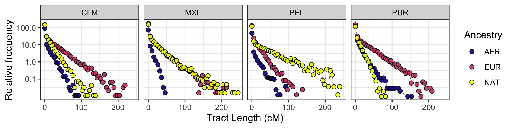

# Pipeline to visualize local ancestry results

I previously ran [XGMix](../../workflow/rules/210409-lai-xgmix.smk) for a three population model and a four population model.
I use this pipeline to generate some plots of those results.

If you wish to visualize the three or two populations LAI results,
change the specification in the ****config.yaml* file.


# Caryotype ploting

To plot a caryotype for a particular individual, use:

```bash
snakemake -j2 plots/3-pops/karyo-HG00551.png
```


# Tract length distribution

```bash
# you can set more cores
snakemake  -j5 plots/3-pops/tracts-subpopulations.png
```


# Global Ancestry

- TODO



# Requeriments

The packages needed to run this pipeline are indicated [here](../envs/popgene.yaml)
