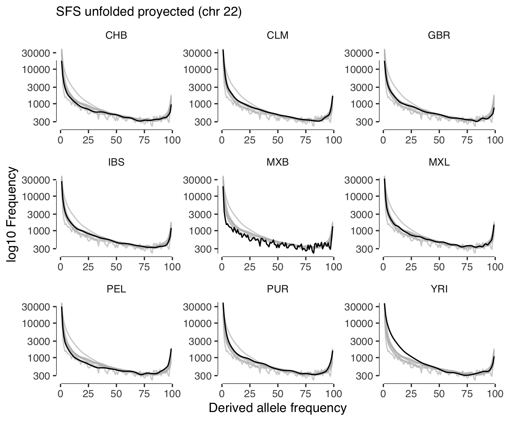

# Computing SFS unfolded

Here, I generate the SFS for each of the populations we are using in the project.
This is an exploratory analysis to check that the SFS looks fine.

# Pipeline

- Get biallelic variants
- Compute the SFS
- Plot

To compute the SFS, we need the ancestral allele information, this data can be found [here](../210506-AncestralAlleleData/).

The [code](../../mxbgenomes/sfs.py) to compute SFS.

# Results

# Next steps

The next step is to partitioin the variants in synonymous, missense, and nonsense (loss-of-function) then we will look
at the SFS for each of these categories.
