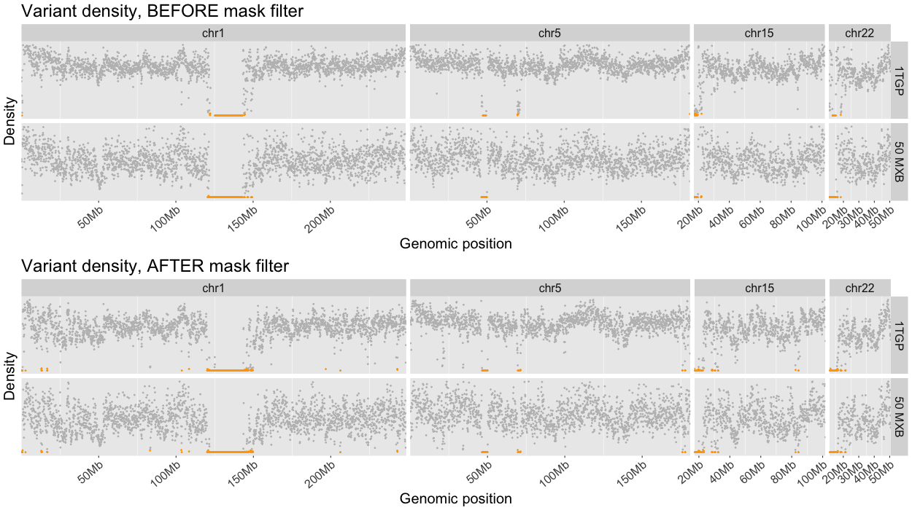

# Overview

# Protocol

I computed the variant density in windows across the genome. See the script [variant_density.py](variant_density.py).

The variant density in the 1TGP data is higher, the reason for this is because
there are more samples. To make the visual comparison easier I scaled the
data in the range 0 to 1.

1. Remove outliers

# Results

- Points in green are region with low variant density.

# Conclusion

