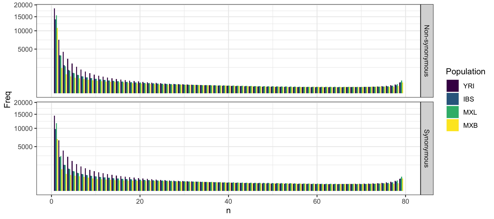
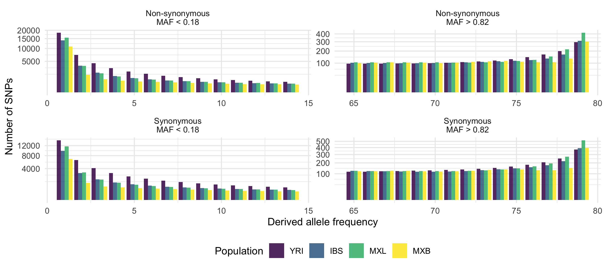
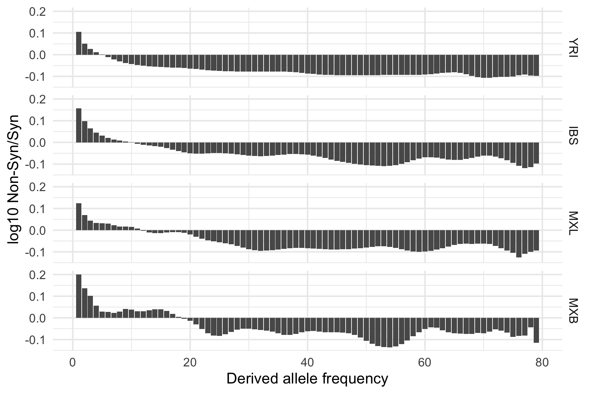

#  Analyzing the distribution of variants: Synonymous vs Non-Synonymous

## Overview

I will look at the SFS distribution for the variants in the following categories: 
- Synonymous variant
- Non-synonymous variant:
    - In-frame insertion
    - In-frame deletion
    - Missense variantlll

For each of these, I will look at the SFS distribution, for each populations. This is similar to the
[previous sfs analysis](../210404-AncestralAlleleSFS).

# Results

**SFS stats**

This table is for synonymous variants.

| case              |      n |         p |
|:------------------|-------:|----------:|
| aa_is_ref         | 127007 | 90.6927   |
| aa_is_alt         |   9228 |  6.5895   |
| aa_is_dot         |   2499 |  1.78448  |
| aa_is_N           |    141 |  0.100685 |
| aa_missing        |    619 |  0.442013 |
| aa_not_ref_or_alt |    547 |  0.3906   |

Focus on low frequency and high frequency variants.

Comparing the number of Non-synonymous variants to synonymous.

