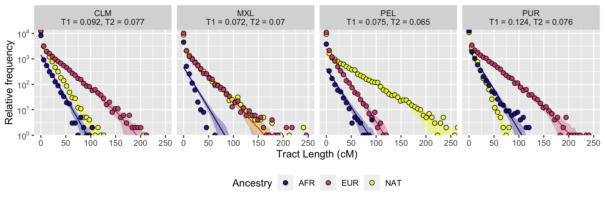

# Fit tracts 3-population model ppx_xxp

# Model: ppx_xxp

Here, I fit the tracts 3 population model ppx_xxp to the admixed populations in the Americas.

I [processed the XGMix output](../210514-ProcessXGMixOutForTracts) to run tracts analysis.

Note: I am using [Aaron's](https://github.com/apragsdale/tracts/tree/python3) tracts branch for python3.

The ancestry proportions are fixed. This model estimates two parameters: tstart and t3, tstart is the arrival times of pops (NAT, EUR) t3 is the
        arrival time of pop AFR.

To fit the model we used a brute force search.

## Results

The tracts best found parameters are indicated on the plot (T1 = tstart, T2 = t3). In this project we are mainly interested in the MXL data. This particular model does not fit well the MXL data. After talking with Andres we suggested that we need to include   a second pulse of European migration.

