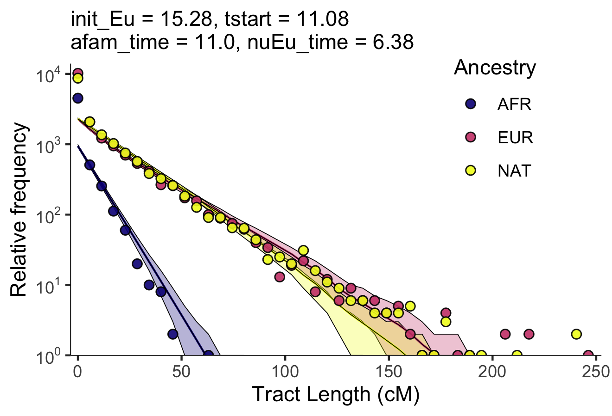

## Fitting ppx_xxp_pxx model to MXL data

## model: ppx_xxp_pxx

A model in which populations Eu and NAT arrive discretely at first generation, Af at a subsequent generation, 
    and Eu discretely yet later. 
    . If a time is not integer, the migration 
    is divided between neighboring times proportional to the non-integer time fraction. 
    We'll assume population 3 
    replaces after the replacement from population 1 and 2 if they arrive at same generation. 
    The first generation is equally composed of pops 1 and 2
    order is ['CEU','NAT','YRI']


This model estimates four parameters: *TODO: verify the interpretation of this parameters.*

    - init_Eu -> ??
    - tstart -> time for the arrival times of pops (NAT, EUR)
    - afam_time -> time of arrival for AFR.
    - nuEu_time -> 2nd time of arrival for EUR.

The ancestry proportions are fixed.

To find the parameters we are using a brute force search. We are exploring the following grid of parameters:

```
slices = (slice(.08, .14, .01), 
    slice(.08, .14, .01), 
    slice(0.04, .1, .02), 
    slice(0.04, .1, .02))
```


## Results




## Notes

The model [ppx_xxp_pxx.py](ppx_xxp_pxx.py) was obtained from a file that contains other tracts models.
This file is in kexol: */data/programs/tracts-master/cont_pulse_model_unif_params_updatedOct2013.py*

I took this model and made some modifications so it can run with tracts (python3 branch).
