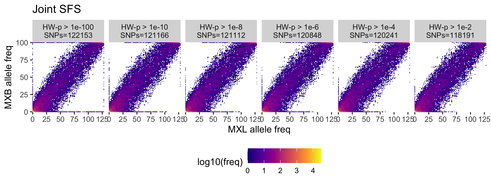

# Compute the HW test to filter variants

## Overview

In the joint SFS we have observed that there are variants that are not called in the MXB
but called in the 1TGP and vice-versa. Here, we will use the HW test to see if we can filter those variants.

I fill focus on the MXL and MXB samples.

To compute the HW statistic I wrote this [function](../../mxbgenomes/stats.py).

## Protocol

- Get the MX samples 50 MXB + MXL.
+ Get SNPs that are variable in those samples. For example, if a variant is only present in the YRI population it will be discarded for this analysis.
+ Compute Hardy Weinberg p values.
+ Select SNPs bassed on a HW pvalue threshold.
+ Compute joint SFS.

## Results

This plot shows the SFS after dropping variants not passing the HW pvalue threshold. This threshold is shown on top of each grid, the number of SNPs that pass the filter is also shown.

