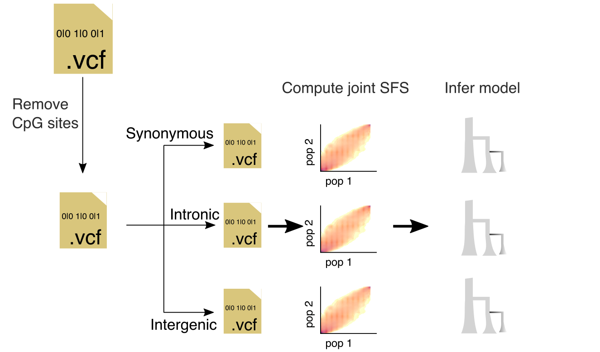

# Pipeline to compute joint Site Frequency Spectrum




Here, I describe the steps taken to generate the joint-SFSs that later are used for demographic inference.

## Input files:

* __VCF |__: genotypes VCFs with vep-ensemble  annotation. I'm ussing the VCFs after removing SNPs not in HW.
* __Reference genome |__: GRCh38 reference genome with chromosome names matching chromosome names in VCF

For the specific files I'm using see the [Snakefile](./Snakefile).

## Step: Exclude CpG sites

I exclude the CpG sites. See [script](../../../scripts/removeCpGsites.py).


```bash
conda activate popgene2 # I need cyvcf2 and Biopython packages
snakemake -j2 data/stats/removed-CpGs-chr22.txt
conda deactivate
```


## Step: Subset variants to a particular category (e.g. synonymous)

I need to generate a table with the [classification](https://m.ensembl.org/info/genome/variation/prediction/predicted_data.html) for each variant, so I can subset the VCF to
specific classifications.

To run this part I need to add the [split-VEP pluggin](https://samtools.github.io/bcftools/howtos/plugin.split-vep.html).

This step gives a VCF file for each variant category. I also merge the VCFs from the autosome into a single VCF.

```bash
conda activate popgene # This is a different environment than the one above.
# I need vep with the plugging
snakemake -j2 data/vcfs/Snps-csq-synonymous-chr22.vcf.gz
conda deactivate
```

## Step: Population to use for joint SFS.

I use the following populations IBS, YRI, CHB, MXL, and NAT.

**NOTE**: For each population, I took a sample of 25 individuals. This is because we want to work with a reasonably-sized jointSFS.

## Step: Compute joint SFS

Next, I compute the joint SFS with this [script](../../../scripts/jsfs.py).

## Running the pipeline

Enter the commands below to run the pipeline.

```bash
conda activate popgene2
snakemake -j22 data/stats/removed-CpGs-chr{1..22}.txt
conda activate popgene # This is a different environment than the one above.
# I need vep with the plugging
snakemake -j30 all
conda deactivate
# clean temporal files
rm -rf data/variants-cats/
rm -rf data/vcfs/
```

## Test

Next, run the notebook [Test-Analysis.ipynb](Test-Analysis.ipynb) to make sure things went ok.
