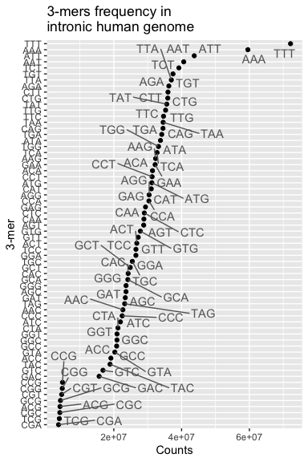

Computing the mutation rate in intronic and intergenic sequences
================

## Overview

We want to estimate the mutation rate parameter *m**L* for the human
genome in **intronic** and **intergenic** sequences. Later we will use
these mutation rates to infer the demographic model with intronic and
intergenic SNPs.

In these notes, I will show the procedure to get *m**L* for the
intergenic genome.

## Step 1: Get intronic sequences

I used the human genome annotation data
[hg38](https://bioconductor.org/packages/release/data/annotation/html/TxDb.Hsapiens.UCSC.hg38.knownGene.html)
to obtain the regions that are intronic in bed format. This is the same
genome build that we’ve been using in the proyect. Then I used the
[masked
genome](https://www.bioconductor.org/packages/BSgenome.Hsapiens.UCSC.hg38.masked/)
to obtain the sequences.

[Script](00-get-intronic-intergenic-regions.R)

``` r
Biostrings::readDNAStringSet("data/regions/intergenic.fasta")
```

    ## DNAStringSet object of length 30820:
    ##            width seq                                        names               
    ##     [1]    11868 NNNNNNNNNNNNNNNNNNNN...ATTCACCATTTTTCTTTTC intergenic_1
    ##     [2]     3444 GCCCAGTGTGTGGTATTTTG...AAGCATTCCAGCAACATGA intergenic_2
    ##     [3]    16391 GGAGCTGGGCACAGGGCAGC...GGATAGAGTAAATAATTCT intergenic_3
    ##     [4]     4285 GTCTCCATGGAAAGACTGGG...ATTACATAAATGAAGATTA intergenic_4
    ##     [5]     1302 AATGACTACCTTTAATTTTG...AAAGCTCAGACTGGCTATT intergenic_5
    ##     ...      ... ...
    ## [30816]     2526 ACGGGTGACTCCTAGATCCC...GTCACTCTGAGTTGAGATG intergenic_30816
    ## [30817]       56 GCTGGGGGTGGGGTGGGGGT...CAGGCAGCCACGGAGCTTT intergenic_30817
    ## [30818]     9335 GAGATGCTTTCTGGACTTCT...CTGCCTCACTGCTCAGGAC intergenic_30818
    ## [30819]     1513 CTGCGGCCTCCCGTTCCCCC...ACTGCTGTGCTAGCAATCA intergenic_30819
    ## [30820]    17159 TTGCTCAGACTCAGGTATTT...NNNNNNNNNNNNNNNNNNN intergenic_30820

## Step 2: Count 3-mers in sequences

The next step is to count each 3-mer sequence (there are 64 3-mers plus
the masked 3-mers, e.g. **NNN**). To get the total count I aggregate
across all sequences.

<!-- -->

[Script](count-3mers-in-seqs.py)

## Step 3: Compute the mutation rate

The following CpG sites will be excluded from the mutation rate
computation:

    ## [1] "CGA" "CGT" "CGG" "ACG" "TCG" "GCG" "CCG" "CGC"

[See this
note](https://github.com/santiago1234/mxb-genomes/issues/4#issuecomment-992912675).

We have the following table with the mutation rate obtained from the
paper [“The mutational constraint spectrum quantified from variation in
141,456 humans”](https://www.nature.com/articles/s41586-020-2308-7).

    ## # A tibble: 6 x 5
    ##   context ref   alt   methylation_level        mu_snp
    ##   <chr>   <chr> <chr>             <dbl>         <dbl>
    ## 1 AAA     A     C                     0 0.00000000183
    ## 2 AAA     A     G                     0 0.00000000303
    ## 3 AAA     A     T                     0 0.00000000107
    ## 4 AAC     A     C                     0 0.00000000139
    ## 5 AAC     A     G                     0 0.00000000525
    ## 6 AAC     A     T                     0 0.00000000136

There are 3 methylation levels 0, 1, and/or 2. All the 3-mers have the
level 0 while other only have 1 and 2.

#### Q1: ?

I have filter to only keep the data for methylation level 0.

#### Q2: ?

Also, there 32 3-mers. We have half because each sequence represents the
sequence and its reverse complement. For example, *TCA* represents *TCA*
and *TGA*.

#### Q3: ?

    ## # A tibble: 3 x 5
    ##   context ref   alt   methylation_level        mu_snp
    ##   <chr>   <chr> <chr>             <dbl>         <dbl>
    ## 1 TCA     C     A                     0 0.00000000231
    ## 2 TCA     C     G                     0 0.00000000214
    ## 3 TCA     C     T                     0 0.00000000580

For each 3-mer we have 3 possible mutations, each one has its own
*μ*<sub>*S**N**P*</sub>, to get the total for each 3-mer I sum those 3
values for each 3-mer.

    ## # A tibble: 1 x 2
    ##   context       mu_snp
    ##   <chr>          <dbl>
    ## 1 TCA     0.0000000103

Finally, to get the total mutation rate I multiply the 3-mer frequencies
by the mutation rate and then add all 3-mers.

*μ*<sub>*L*</sub> = ∑<sub>*i*</sub>*F*<sub>*i*</sub> \* *μ*<sub>*i*</sub>

Where:

-   *F*<sub>*i*</sub> frequency of k-mer i.
-   *μ*<sub>*i*</sub> mutation rate for k-mer i.

For intronic SNPs we get: *m**L* = 17.036568409994402

And for intergenic SNPs *m**L* = 10.733330628762701
